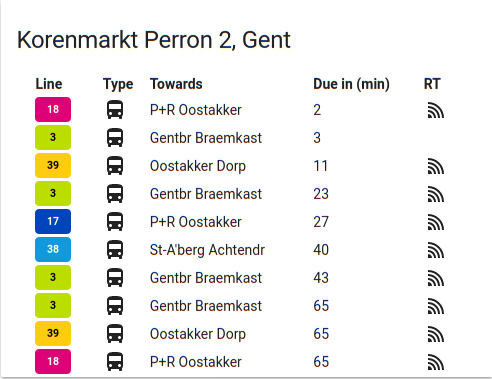

# delijn-card

This card generates a passages card for the De Lijn public transport service in Flanders (Belgium).



## Options

| Name | Type | Requirement | Description
| ---- | ---- | ------- | -----------
| type | string | **Required** | `custom:delijn-card`
| entity | string | **Required** | The entity_id of the entity you want to show.
| title | string | **Optional** | Add a custom title to the card.
| config_type | string | **Optional** | 'default' for standard setup, 'raw' for raw entity data, 'columns' for defining a custom list of columns. If this option is not added the default setup will be shown in the card.
| columns | object | **Optional** | List of columns to display.

## Column object

| Name | Type | Requirement | Description
| ---- | ---- | ------- | -----------
| title | string | **Required** | Column header to display.
| field | string | **Required** | key value of the entity that you wish to display.

## Installation

### Step 1

Install `delijn-card` by copying `delijn-card.js` from this repo to `<config directory>/www/delijn-card.js` of your Home Assistant instance.

**Example:**

```bash
wget https://github.com/bollewolle/delijn-card/raw/master/delijn-card.js
mv delijn-card.js ~/.homeassistant/www/
```

### Step 2

Set up the De Lijn custom sensor.

**Example:**

```yaml
sensor:
  - platform: delijn
    api_key: '<put your data.delijn.be API subscriptionkey here>'
    next_departure:
    - stop_id: '200552'
      number_of_departures: 10
```
**_Note_**: replace with the API subscription key you generated with you data.delijn.be developer account.

### Step 3

Link `delijn-card` inside you `ui-lovelace.yaml` or via the `Raw config editor` when using the `Configure UI` in the Home-Assistant interface directly.

```yaml
resources:
  - url: /local/delijn-card.js
    type: js
```

### Step 4

Add a custom element in your `ui-lovelace.yaml`. Or when using the `Configure UI` in the Home-Assistant interface directly you can add a `Manual Card` with this in the Card Configuration.

**Example:**

Example with default layout in the `ui-lovelace.yaml`:
```yaml
      - type: 'custom:delijn-card'
        entity: sensor.korenmarkt_perron_2_gent
        title: 'Korenmarkt Perron 2, Gent'

```
Same when going via the `Configure UI`:
```yaml
entity: sensor.korenmarkt_perron_2_gent
title: 'Korenmarkt Perron 2, Gent'
type: 'custom:delijn-card'


```


Example with a custom layout in the `ui-lovelace.yaml`. In this case also the scheduled and real-time times are shown:
```yaml
      - type: 'custom:delijn-card'
        entity: sensor.brugsepoort_gent
        title: 'Brugsepoort, Gent'
        config_type: columns
        columns:
          - field: line_number_public
            title: Line
          - field: line_transport_type
            title: Type
          - field: final_destination
            title: Towards
          - field: due_in_min
            title: Due in (min)
          - field: due_at_realtime
            title: Due at (real-time)
          - field: due_at_schedule
            title: Due at (scheduled)

```

Same when going via the `Configure UI`:
```yaml
columns:
  - field: line_number_public
    title: Line
  - field: line_transport_type
    title: Type
  - field: final_destination
    title: Towards
  - field: due_in_min
    title: Due in (min)
  - field: due_at_realtime
    title: Due at (real-time)
  - field: due_at_schedule
    title: Due at (scheduled)
config_type: columns
entity: sensor.brugsepoort_gent
title: 'Brugsepoort, Gent'
type: 'custom:delijn-card'

```


## Credits

Thanks to [cgtobi's rmv-card](https://github.com/cgtobi/rmv-card) and [Ian Richardson's list-card](https://github.com/custom-cards/list-card) for all the initial work and inspiration.